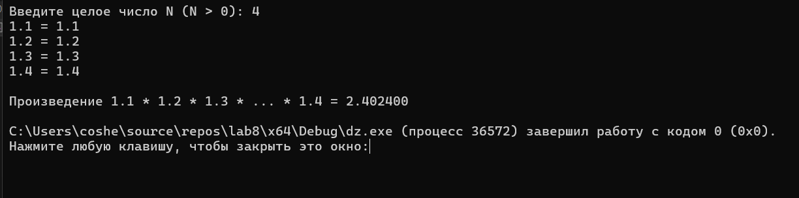

# Домашнее задание к работе 6
## Условие задачи
 Calculate min(x^2 +y^2; y^3-2*x^2)-4, where x, y - input variable.
## 1. Алгоритм и блок-схема
### Алгоритм
1. Начало
2. Объявить константы:
   - x = переменная.
   - y = переменная.
   - s1 = расчёт 1 выражения.
   - s1 = расчёт 2 выражения.
   - a = расчёт.
3. Считаем:
  s1 = x * x + y * y;
  s2 = y * y * y - 2 * x * x;
  a = (s1 < s2) ? s1 : s2;
  a -= 4;
4. Выводим результаты расчетов:
   -  printf("Результат: %.6f\n", a);
      printf("Где x = %.2f, y = %.2f\n", x, y);
      printf("1 Варажение: %.2f\n", s1);
      printf("2 Варажение: %.2f\n", s2);

5. Конец
### Блок-схема

## 2. Реализация программы:
 #define _CRT_SECURE_NO_WARNINGS
 #include <stdio.h>
 #include <locale.h>
 #include <math.h>
 
 int main() {
     setlocale(LC_CTYPE, "RUS");
     double x, y, a;
     printf("Введите x: ");
     scanf("%lf", &x);
     printf("Введите y: ");
     scanf("%lf", &y);
     double s1 = x * x + y * y;
     double s2 = y * y * y - 2 * x * x;
     a = (s1 < s2) ? s1 : s2;
     a -= 4;
     printf("Результат: %.6f\n", a);
     printf("Где x = %.2f, y = %.2f\n", x, y);
     printf("1 Варажение: %.2f\n", s1);
     printf("2 Варажение: %.2f\n", s2);
 
     return 0;
 }
## 3. Результат работы программы

## 4. Информация о разработчике
Амелина Юлия, бИПТ-252
