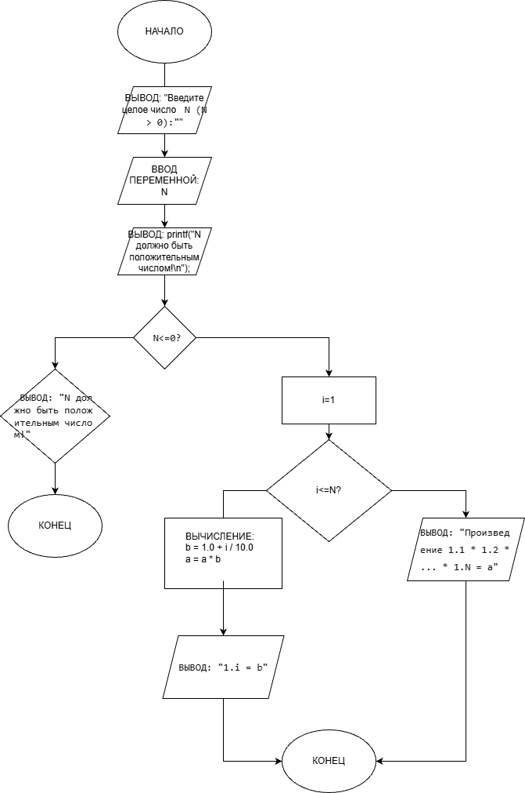

# Домашнее задание к работе 8
## Условие задачи
Вычислите для целого N, заданного пользователем, значение
произведения 1.1*1,2*1,3*..*l,N

## 1. Алгоритм и блок-схема
### Алгоритм
1. Начало
2. Объявить константы:
   - N = переменная.
   - a = расчёт.
   - b = расчёт.
   - i = счётчик.
3. Считаем:
 for (int i = 1; i <= N; i++) {
    double b = 1.0 + i / 10.0; 
    a *= b;
    printf("1.%d = %.1f\n", i, b);
}
4. Выводим результаты расчетов:
printf("\nПроизведение 1.1 * 1.2 * 1.3 * ... * 1.%d = %f\n", N, a);
5. Конец
### Блок-схема

## 2. Реализация программы:
   #define _CRT_SECURE_NO_WARNINGS
   #include <stdio.h>
   #include <locale.h>
   #include <math.h>
   int main()
   {
       setlocale(LC_CTYPE, "RUS");
   
       int N;
       double a = 1.0; 
   
       printf("Введите целое число N (N > 0): ");
       scanf("%d", &N);
   
       if (N <= 0) {
           printf("N должно быть положительным числом!\n");
           return 1;
       }
        for (int i = 1; i <= N; i++) {
           double b = 1.0 + i / 10.0; 
           a *= b;
           printf("1.%d = %.1f\n", i, b);
       }
   
       printf("\nПроизведение 1.1 * 1.2 * 1.3 * ... * 1.%d = %f\n", N, a);
   
       return 0;
   }
## 3. Результат работы программы

## 4. Информация о разработчике
Амелина Юлия, бИПТ-252
